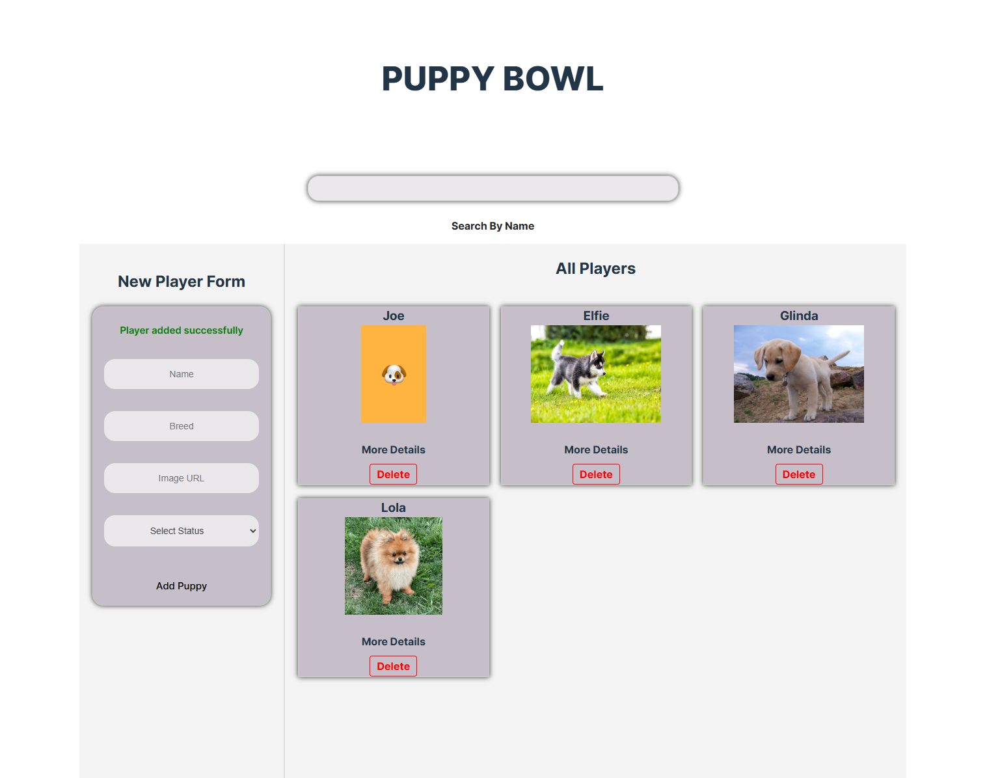
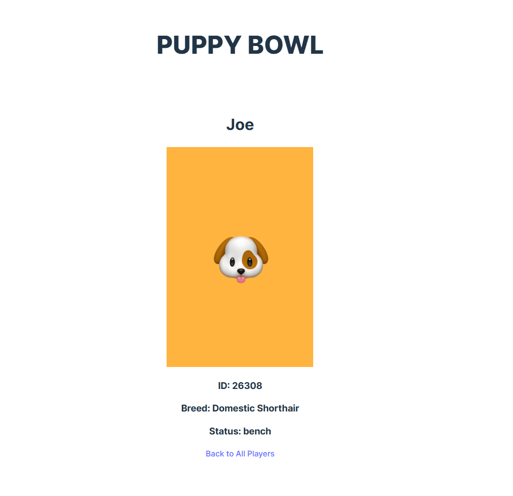

# React Puppy Bowl Project

Link: https://superlative-melba-17b5c9.netlify.app/

This project allows users to interact with a list of puppies competing in the Puppy Bowl. They can view player details, create new players, search for specific players by name, and delete players. The project is built using React and provides an engaging user interface.

## Features

- **View Players**: See a list of puppies competing in the bowl.
- **Player Details**: Click on a "See Details" button to view specific details about each player, including the player's name, team, and owner.
- **Create New Player**: A form that allows users to create a new player, which will be added to the list of competitors.
- **Search Players**: A search bar where users can type a player's name and see only the players that match the search criteria.
- **Delete Player**: A delete button that removes a player from the list.

## Design & Development Highlights

- Designed an engaging game interface to streamline player management and improve user interaction with player data.
- Integrated **React Router** for seamless navigation between pages and dynamic route handling.
- Implemented **CRUD** functionality, including adding, viewing, and deleting players via **JavaScript Fetch API**.
- Managed state effectively with **useState** and **useEffect** hooks for real-time updates.
- Used **Git/GitHub** to maintain clean, well-documented code.

## Tools & Technologies

- **React**: For building the user interface.
- **JavaScript**: For implementing the app's functionality.
- **CSS**: For styling the components.
- **HTML**: For structuring the content.
- **APIs**: For handling data and CRUD operations.

## Installation

To run the project locally, follow these steps:

1. Clone this repository:
   ```bash
   git clone https://https://github.com/deniseosoria/puppy-bowl-react

2. Navigate to the project directory:

    ```bash
    cd puppy-bowl-react
    ```

3. Install dependencies:

    ```bash
    npm install
    ```

4. Run the development server:

    ```bash
    npm start
    ```

5. Visit `http://localhost:3000` to view the app in action.

## Images

- **View Players**:


- **Player Details**


